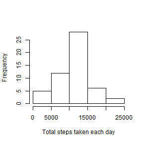
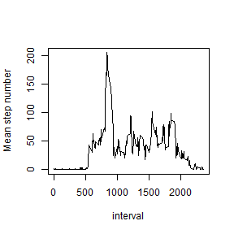
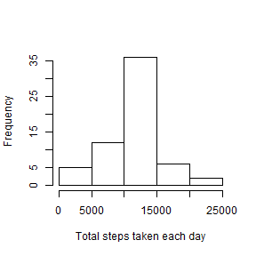
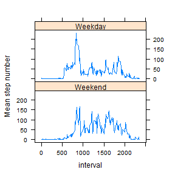

# Reproducible Research: Peer Assessment 1
#### The working directory has been set, and the unziped data file "activity.csv" has been in the working directory.

## Loading and preprocessing the data


```r
# Set global options: show the code, make figure size 4X4
opts_chunk$set(echo = TRUE, fig.height = 4, fig.width = 4)
```


```r
# Load the data
data <- read.csv("activity.csv",na.strings = "NA",
  	colClasses = c("numeric","Date","numeric"))
# Not necessary to process/transform the data at this moment
```


## What is mean total number of steps taken per day?


```r
# Calculate the total number of steps taken per day using 'ddply' in "plyr" package 
library(plyr)
daily.step <- ddply(data,.(date),summarize,total.step=sum(steps))
# Make a histogram of the total number of steps taken each day
hist(daily.step$total.step,xlab="Total steps taken each day",main="")
```

 

```r
# Calculate and report the mean and median of the total number of steps taken per day
mean <- mean(daily.step$total.step,na.rm=TRUE)
median <- median(daily.step$total.step,na.rm=TRUE)
```
The mean of the total number of steps taken per day is 10766.  
The median of the total number of steps taken per day is 10765.


## What is the average daily activity pattern?


```r
# Calculate the average stepts by each interval
meanstep.by.interval <- ddply(data,.(interval),summarize,mean.step=round(mean(steps,na.rm = TRUE),digits = 0))
# Make a time series plot
with(data=meanstep.by.interval,
plot(mean.step~interval,type = "l",ylab="Mean step number")
)
```

 

```r
# Find the interval which has the maximum average stepts
max <- arrange(meanstep.by.interval,desc(mean.step))[1,]
```
Interval 835 has the maximum number of steps = 206


## Imputing missing values


```r
# Calculate the total number of missing values in the dataset
total.na <- sum(is.na(data$steps))
```
The total number of missing values in the datase is 2304.  

Use the mean steps of each interval to impute the missing data in each corresponding interval

```r
# Use the mean steps of each interval to impute the missing data
impute <- merge(data[is.na(data$steps),],meanstep.by.interval,x.by=interval,y.by=interval)[,c(4,3,1)]
colnames(impute) <- colnames(data)

# Create a new dataset that is equal to the original dataset but with the missing data filled in
data.imputed <- rbind(data[!is.na(data$steps),],impute)
data.imputed <- data.imputed[order(data.imputed$date,data.imputed$interval),]

# Make a histogram of the total number of steps taken each day 
daily.step.imputed <- ddply(data.imputed,.(date),summarize,total.step=sum(steps))
hist(daily.step.imputed$total.step,xlab="Total steps taken each day",main="")
```

 

```r
# Calculate the mean and median total number of steps taken per day
mean2 <- mean(daily.step.imputed$total.step)
median2 <- median(daily.step.imputed$total.step)
```
The mean of the total number of steps taken per day after imputation is 10765.  
The median of the total number of steps taken per day  after imputation is 10762.  
These values do not differ from the estimates from the first part of the assignment.  
There is very little impact of imputing missing data on the estimates of the total daily number of steps.  


## Are there differences in activity patterns between weekdays and weekends?


```r
# Create a new factor variable with weekdays
data.imputed <- mutate(data.imputed, day = weekdays(date))

# Find the rows of "weekend"
weekend <- weekdays(data.imputed$date) %in% c("Saturday","Sunday")
# Replace the days with "Weekend" or "Weekday" accordingly
data.imputed[weekend,4] <- "Weekend"
data.imputed[!weekend,4] <- "Weekday"


# Calculate the mean steps per interval for each level - "Weekend" and "Weekday"
data.weekend <-subset(data.imputed, day == "Weekend")
step.weekend <- ddply(data.weekend,.(interval),summarize,mean.step=mean(steps))
day <- rep("Weekend",dim(step.weekend)[1])
step.weekend <- cbind(step.weekend,day)

data.weekday <-subset(data.imputed, day == "Weekday")
step.weekday <- ddply(data.weekday,.(interval),summarize,mean.step=mean(steps))
day <- rep("Weekday",dim(step.weekday)[1])
step.weekday <- cbind(step.weekday,day)

# A new dataset which has the mean steps per interval for both "weekend" and "weekday"
step.interval <- rbind(step.weekend,step.weekday)


# Make a panel plot containing a time series plot using lattice
library(lattice)
xyplot(mean.step ~ interval | day, data = step.interval,
   layout = c(1,2),ylab="Mean step number",type="l")
```

 

